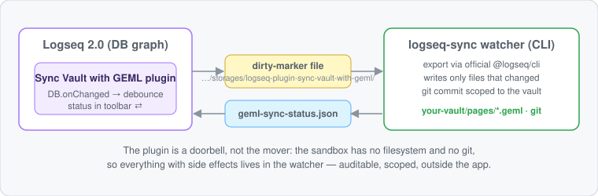
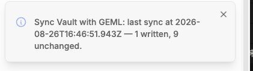
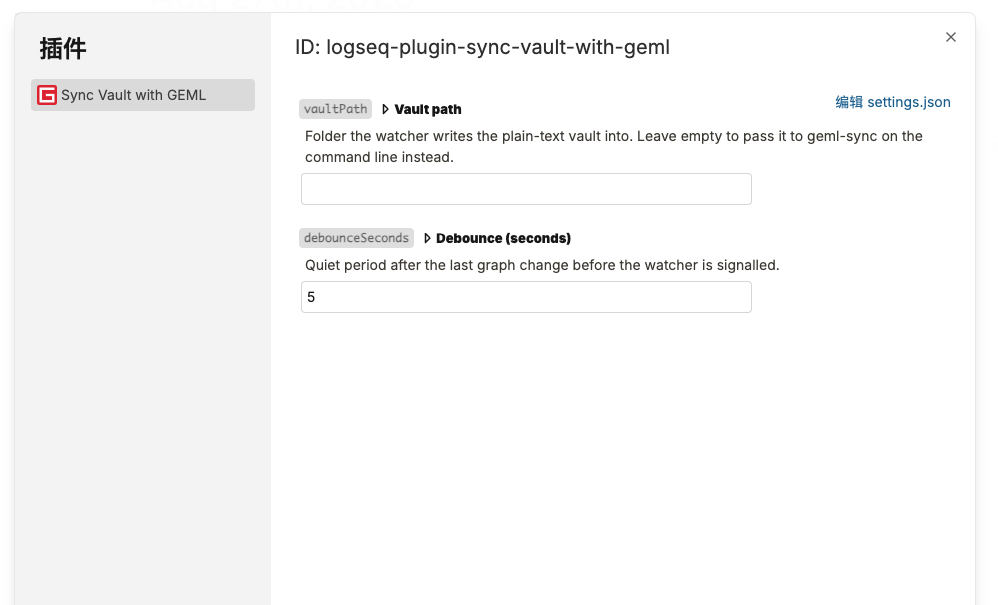

# Sync Vault with GEML

Your Logseq DB graph as **continuously synced plain-text files** — pages and
journals back in readable files and folders, the way OG vaults felt, kept in
step with the database. And, when you want it, back again.



Edit a block; seconds later the file on disk has caught up, and the toolbar says
so:



Two settings, and only the first one usually needs touching:



## What you get

- 📦 **A plain-text copy that stays yours** — every page a readable file, not a
  database dump, in a folder you chose
- 🔁 **Continuous, not one-shot** — edit in Logseq, and seconds later the file
  on disk has caught up; with `--two-way`, edit the file and the graph
  catches up the same way
- ↩️ **A way back** — `logseq-sync restore` imports the vault into a graph,
  merging by block uuid. Files you can read are worth more when they are also
  files you can return
- 🌿 **Git if you want it** — point the vault at a repository and every sync is
  a clean commit with a line-by-line diff. Point it at a plain folder, or one
  your backup tool already watches, and nothing git-shaped appears

A vault is not a mirror by default: pages you delete in Logseq are **kept** on
disk and reported, because a plain folder has no history to recover them from.
`--mirror` is how you ask for an exact copy instead.

Logseq 2.0 ships both ends of a trade-off: `logseq export` gives Markdown
(readable, lossy) and `logseq export-edn` gives EDN (lossless, not something a
person edits). The vault's format, [GEML](https://github.com/geml-spec/geml),
is the point between: **as readable as the Markdown export, as lossless as the
EDN one** — and addressable, so external tools and agents can edit one block
of a graph instead of round-tripping all of it.

The tree is laid out the way an OG vault is — the thing a file-version user
recognizes as "my graph, as files again":

```
{:pages-and-blocks [...]}          ontology.geml            :properties/:classes, verbatim EDN
                          ⇄        graph.geml               page ORDER (an addressable data block,
                                                            so filenames need no numeric prefixes)
                                   journals/2025_02_20.geml journal pages, OG date names
                                   pages/<name>.geml        one per page:
                                     block title  → `=== text` body
                                     block uuid   → `{#uuid}`  ← geml get/set address
                                     outline tree → flat blocks with `.level-N`
                                     everything else rides along in `code {lang=edn}`
```

(Journal pages export as pages carrying `{:build/journal <yyyymmdd>}`, and the
mapping routes them into `journals/` under their OG date name — verified on a
live 2.0.1 graph, schema 65.33.)

## How it works — two halves, one honest boundary

A Logseq 2.0 plugin runs in a sandboxed iframe: no arbitrary-path filesystem,
no git, no shell (verified against the 2.0.1 app bundle). So the in-app plugin
(`plugin/`) does the only two things only it can do:

- **hear** the graph change (`logseq.DB.onChanged`, debounced) and write a
  dirty-marker file through the plugin storage API;
- **show** the last sync result in the toolbar (`⇄`) and command palette.

Everything with side effects lives in the **watcher** (`watcher/bin/logseq-sync.mjs`),
built on Logseq's own EDN export. It reacts to the marker file
immediately (interval polling stays on as a fallback), writes only the files
that actually changed — so `git diff` is never noise — commits with a pathspec
scoped strictly to the vault, and reports back for the toolbar to display.
The two halves meet in the plugin's own storage directory
(`<dotdir>/storages/logseq-plugin-sync-vault-with-geml/`), the one disk location both can
reach. A file as the bridge beats a local HTTP API: no port, no server, no
CORS.

Real output, real DB graph (exported with the official CLI, validated by
`logseq validate`):

```text
$ logseq-sync geml-spike ~/vault-demo --once --git-commit --no-signal
Sync Vault with GEML: graph "geml-spike" ➔ ~/vault-demo
  export via  @logseq/cli, opening the graph file directly — close the graph in Logseq first
  git         auto-commit on, scoped to the vault
[10:15:28] Synced: 8 written, 0 unchanged.
  Git: [master (root-commit) 2854063] logseq-geml: sync graph "geml-spike"
 9 files changed, 142 insertions(+)
 create mode 100644 graph.geml
 create mode 100644 pages/contents.geml
 ...

$ logseq-sync geml-spike ~/vault-demo --once --git-commit --no-signal   # run again
[10:15:31] Graph is up-to-date (0 written, 8 unchanged).
```

## Setup

**1. Install the plugin.** From the marketplace, or download the zip from the
[latest release](https://github.com/geml-spec/logseq-plugin-sync-vault-with-geml/releases/latest)
and load it — the release carries the built plugin, so there is nothing to
compile.

**2. Set the vault folder** in Logseq: Settings → Plugins → *Sync Vault with
GEML* → **Vault folder**. Any folder you like — `~/logseq-vault`, a directory
inside a repository you already keep, one your backup tool already watches. It
is created if it does not exist, `~` means your home directory, and `restore`
reads the vault back from the same place. There is deliberately **no default**:
left empty, `logseq-sync` asks you for a folder rather than picking one for you.

That is the folder the files are written **into**; the graph they come **from**
is detected, and you do not name it.

**3. Run the watcher:**

```sh
npx @geml/logseq-sync
```

That is the setup. With no arguments the watcher works out the rest: the CLI
that ships inside the Logseq app, the graph the app currently has open, the
plugin's signal file, and the vault path you just set. It makes the vault a
git repository if it is not one already, syncs, and keeps watching. Edit a
block in Logseq → the plugin signals → the watcher syncs → the toolbar `⇄`
shows `Sync Vault with GEML: last sync at … — 1 written, 7 unchanged.`

Not sure it is wired up? **`npx @geml/logseq-sync doctor`** prints what it
found and what is missing, and exits non-zero when the setup cannot sync:

```text
  ok   Logseq dotdir  /Users/you/.logseq
  ok   plugin         /Users/you/.logseq/storages/logseq-plugin-sync-vault-with-geml
  ok   app CLI        /Users/you/.local/bin/logseq (found on PATH)
  ok   graph          Demo (open in the app)
 MISS  vault          unset — Settings → Plugins → Sync Vault with GEML → "Vault folder"
  ok   git identity   configured
  ok   bridge         /Users/you/.logseq/storages/.../geml-sync-dirty.json
```

### When you want to say it yourself

| | |
|---|---|
| `logseq-sync <vault-dir>` | vault here instead of in the plugin settings |
| `logseq-sync <graph> <vault-dir>` | both explicitly |
| `--graph <name>` | pick the graph — needed when several are open |
| `--once` | sync once and exit, instead of watching |
| `--git-commit` | commit, creating the vault repository if there is none |
| `--no-git-commit` | never touch git |
| `--two-way` | also import vault edits back, every cycle — conflicts held, deletions never imported (needs the app CLI) |
| `--mirror` | delete vault files for pages removed from the graph |
| `--markdown <dir>` | also write the graph there as an OG (file-version) graph the old app opens — lossy, one-way |
| `--overwrite-unmanaged` | overwrite files that were already there before the sync owned them (default: hold and name them) |
| `--interval <seconds>` | heartbeat between signals (default 10) |
| `--app-cli <path>` | a Logseq CLI the search did not find |
| `--signal <file>` / `--no-signal` | the plugin bridge, or none |

### Going back: `logseq-sync restore`

```sh
logseq-sync restore                 # rehearse: says what it would import, writes nothing
logseq-sync restore --yes           # take a Logseq backup, then import the vault
```

The vault imports into the graph by block uuid, so an edit lands in place
rather than duplicating. This is the one direction that writes into your notes,
so it rehearses unless you pass `--yes`, and `--yes` takes the app's own graph
backup first (`--no-backup` opts out, and then you are on your own).

### The exporter, and why the app's own CLI

While Logseq has a graph open its db-worker holds an **exclusive lock** on that
graph's `db.sqlite`, so an exporter that opens the file directly dies with
`database is locked` — which is every export while you are actually working.
The CLI inside the desktop app does not open the file, it asks the running app,
so it exports mid-edit. That is why the watcher looks for it first: on PATH, at
`~/.local/bin/logseq`, then the app bundle itself.

`--no-app-cli` falls back to the separate [`@logseq/cli`](https://www.npmjs.com/package/@logseq/cli)
npm package, which opens the graph file directly. It is only useful against a
graph the app does **not** have open, and on Node 24 it needs a
`better-sqlite3` override to install at all:

```sh
mkdir logseq-cli && cd logseq-cli && npm init -y
npm pkg set overrides.better-sqlite3=12.11.1
npm i @logseq/cli
# then: LOGSEQ_CLI_DIR=$PWD logseq-sync --no-app-cli …
```

`--api-server-token` (or `LOGSEQ_API_SERVER_TOKEN`) routes that fallback
through the app's HTTP API server rather than the file — but `@logseq/cli`
0.4.3 hardcodes `http://127.0.0.1:12315` and Logseq 2.0.1 does not listen
there, so on 2.0.1 this path goes nowhere. Prefer the app CLI.

**Settings**: *Vault folder* — where the files are written, and where `restore`
reads them back from. *Debounce (seconds)* — quiet
period after the last change before the watcher is signalled (default 5; syncs
feed git commits, so this is deliberately calmer than UI-style debounce).

### Editing the vault from outside

The vault is ordinary text, and that is the point: agents, scripts and plain
`sed` all work on it, and none of them needs to know Logseq exists. With
`--two-way` running, an edit imports on the next cycle; without it, run
`logseq-sync restore` when you are ready.

**An agent (Claude, or anything speaking MCP)** gets addressed, validated
block edits from the [`geml` MCP server](https://github.com/geml-spec/geml):

```sh
npm i -g @geml/geml
geml mcp --root <your-vault-dir> --no-history
```

`--no-history` matters here: git is this vault's history, and without the flag
every MCP write also saves a `.gemlhistory` sidecar revision beside the file.
(If you want those too, drop the flag — the sync ignores sidecars either way
and never commits them.)

**A one-liner** reads or edits one block by its address — every block carries
its uuid:

```sh
geml find "that phrase" <vault-dir>              # → pages/foo.geml  #<uuid>
geml get  <vault-dir>/pages/foo.geml '#<uuid>'
printf 'new text' | geml set <vault-dir>/pages/foo.geml '#<uuid>' --in - -o <same-file>
```

**Bulk refactoring** is whatever your shell already does — the result is
re-imported by uuid, so identity survives the edit:

```sh
grep -rl "old-tag" <vault-dir>/pages | xargs sed -i 's/old-tag/new-tag/g'
logseq-sync restore <vault-dir> --yes            # or let --two-way pick it up
```

A check after a bulk edit is cheap insurance — it names a mangled block, and a
reference that now goes nowhere, before the import carries either into the
graph:

```sh
geml check <vault-dir>/pages/foo.geml --root <vault-dir>
```

`--root` is what lets a reference into another page resolve: block refs are
translated on the way out, so `[[<uuid>]]` in the graph becomes GEML's checked
`[[#uuid]]` (same page) or `[[../pages/other.geml#uuid]]` (another one), and
the translation reverses exactly on the way back.

## Honesty corner

- The **default** continuous direction is graph → files; going back is a
  deliberate command (`restore`). `--two-way` makes the return trip continuous
  too — every cycle imports what changed in the vault — under three rules that
  say what it does NOT pretend to solve: a file changed on **both** sides
  since the last sync is a conflict, held exactly as you left it (not
  imported, not overwritten, named in the toolbar status until you merge it);
  deletions are **never** imported; and a graph backup is taken before the
  first import and every tenth after. The sync tells its own writes from
  yours by content hash, so nothing echoes.
- **Files the sync did not write are never touched** — not deleted, and not
  overwritten either. A manifest per tree records what the sync wrote; a file
  on disk that no manifest claims belongs to whoever put it there, so it is
  held and named instead of replaced, and `--mirror` only ever removes files
  from that list. This is what makes it safe to point a vault (or
  `--markdown`) at a graph you already have: your pages survive the first
  sync. A file already byte-identical to what the sync would write is adopted
  rather than held — there is nothing of yours to lose. `--overwrite-unmanaged`
  is how you say you meant it.
- **The app's lock is the thing to know about.** A running Logseq holds
  `db.sqlite` exclusively, so the `@logseq/cli` export only works with the app
  closed (or on a graph it does not have open). Continuous sync therefore runs
  through the desktop app's own CLI (`--app-cli`), which asks the running app
  instead of touching the file. Verified on 2.0.1: same 9 documents as the
  offline export, byte-identical except three keys of export metadata.
- **The Markdown tree is an OG graph, and it is a copy.** `--markdown` writes
  Logseq's own file-version dialect — one bullet per block, `id::` for
  identity, `((uuid))` for block refs — so the directory **opens in the file
  version of the app**. It is lossy and one-way: typed properties, tags,
  tables and data blocks have no OG shape and do not survive, the GEML tree
  stays the one that round-trips, and `restore` never reads the Markdown.
  Generic GEML-to-Markdown is `geml <file> --to md`, which belongs to the
  parser; the only reason this integration writes Markdown is Logseq.
- **Restore merges, it does not replace.** An import lands by uuid over
  whatever the graph currently holds; it will not remove pages the vault no
  longer has. Take the backup.
- **A graph name you mistype is created, not rejected.** `logseq graph export
  --graph <name>` silently makes a new empty graph rather than failing, and
  syncing that emptiness would wipe the vault's synced files. The watcher
  refuses any graph name it cannot see under `<root>/graphs` first.
- **A commit that fails is printed, not swallowed.** `git` with no configured
  author (or `user.useConfigOnly`) writes the files and commits nothing;
  `doctor` calls that out up front, and a sync that could not commit says
  `Git: NOT COMMITTED — …` rather than just `Synced`.
- **2.0 renamed the export we read.** `:export-type :graph` now means a datoms
  dump; the `{:pages-and-blocks ...}` shape this converter reads is
  `:graph-human`. The watcher asks for `:graph-human` explicitly.
- The watcher half is tested end-to-end in CI (a planted fake CLI exports
  fixture EDN, so the signal → re-sync → status round trip runs with no Logseq
  installed). The in-app half is verified against the 2.0.1 runtime — the
  plugin API surface, `hook:db:changed`, the storage-file bridge — and its
  SDK is `@logseq/libs` 0.3.x (the `next` tag). If anything misbehaves in
  your setup, an issue with your Logseq version is gold.

## Proven on a live DB graph, judged by Logseq's own validator

`npm test` proves, on fixtures lifted from Logseq's own `deps/db` export tests:

1. **EDN → GEML → EDN is a structural identity** (EDN map/set semantics).
2. Every generated document parses as GEML with **zero error diagnostics**.
3. A block Logseq considers addressable (exported uuid) is **addressable in
   GEML by the same id**.
4. **Editing one block's text changes exactly that block** in the EDN — no
   collateral change anywhere in the graph.

And `bin/live-roundtrip.mjs` has confirmed all four against a real DB graph
(2026-08-20, schema 65.22): export → 6 clean documents → identity; then with
`--edit`, a `geml set` on one block imported back with `logseq import-edn`,
**`logseq validate`: Valid!**, and the re-export showed the edit landed **in
place by uuid, exactly once — whole-graph re-import merges, it does not
duplicate**.

The design and the reasoning live in the
[GEML monorepo](https://github.com/geml-spec/geml)
(`docs/design/specs/2026-08-20-logseq-integration-scoping.md`); the community
threads are
[logseq/logseq#13086](https://github.com/logseq/logseq/discussions/13086) and
[the forum post](https://discuss.logseq.com/t/35193).

## Development

```
core/      converter (mapping.mjs), sync engine, bridge.mjs (the signal/status file contract)
watcher/   the logseq-sync CLI and its end-to-end tests — published to npm as @geml/logseq-sync
plugin/    the in-app half (this package.json is the Logseq plugin manifest)
```

Source of truth is
[`integrations/logseq/`](https://github.com/geml-spec/geml/tree/main/integrations/logseq)
in the GEML monorepo; this repository mirrors it for the marketplace and
carries the releases. Please open issues here, and PRs against the monorepo.

The converter is two pure functions in `core/src/mapping.mjs` —
`ednToGemlFiles(ednText)` and `gemlFilesToEdn(files, lib)` — with the reference
parser injected. The tests import the parser's build:

```sh
cd geml-parser && npm install && npm run build && cd ../integrations/logseq
npm install
npm test
```

Live-stage demos (need `@logseq/cli` via `LOGSEQ_CLI_DIR` — see "The exporter" above):

```sh
node watcher/bin/create-graph.mjs my-graph      # create a DB graph WITHOUT the desktop app
node watcher/bin/live-roundtrip.mjs my-graph            # read-only: export → GEML → back → compare
node watcher/bin/live-roundtrip.mjs my-graph --edit     # + geml set → import-edn → logseq validate
```

Versioning: the MAJOR version tracks the Logseq major it targets — this is
2.x because it speaks Logseq 2.x (DB graphs) and nothing older. Minor/patch
are this package's own.

## Next

- Property readability: scalar `:build/properties` as GEML attributes instead
  of the `.block-meta` EDN ride-along (NAME rules permitting).
- **Write-back**: wiring `syncDiskToEdn` to the CLI so the vault is
  two-way — edit the file, the graph follows.

MIT © GEML contributors
